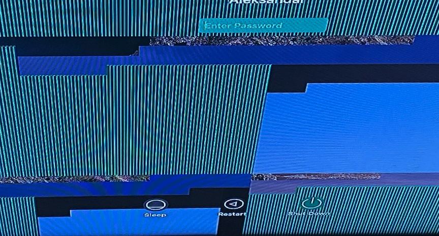

OpenCore ver 0.6.4 · Catalina 10.15.7

**!!! Not stable !!!**

(1) Login windows halts of black screen

```
panic(cpu 2 caller 0xffffff7f8afa1ad5): userspace watchdog timeout: no successful checkins from com.apple.WindowServer since load
service: com.apple.logd, total successful checkins since load (150 seconds ago): 16, last successful checkin: 0 seconds ago
service: com.apple.WindowServer, no successful checkins since load (120 seconds ago)

Backtrace (CPU 2), Frame : Return Address
0xffffff83c02cb6a0 : 0xffffff800a51868d mach_kernel : _handle_debugger_trap + 0x49d
0xffffff83c02cb6f0 : 0xffffff800a652ab5 mach_kernel : _kdp_i386_trap + 0x155
0xffffff83c02cb730 : 0xffffff800a64463e mach_kernel : _kernel_trap + 0x4ee
0xffffff83c02cb780 : 0xffffff7f8e17a6f4 as.vit9696.VirtualSMC : __ZN18VirtualSMCProvider10kernelTrapI22x86_saved_state_1010_tEEvPT_Pm + 0x454
0xffffff83c02cb800 : 0xffffff800a4bea40 mach_kernel : _return_from_trap + 0xe0
0xffffff83c02cb820 : 0xffffff800a517d57 mach_kernel : _DebuggerTrapWithState + 0x17
0xffffff83c02cb920 : 0xffffff800a518147 mach_kernel : _panic_trap_to_debugger + 0x227
0xffffff83c02cb970 : 0xffffff800acbf328 mach_kernel : _panic_with_thread_context
0xffffff83c02cb9e0 : 0xffffff7f8afa1ad5 com.apple.driver.watchdog : __ZN10IOWatchdog14userspacePanicEP8OSObjectPvP25IOExternalMethodArguments.cold.1 + 0x27
0xffffff83c02cb9f0 : 0xffffff7f8afa17fa com.apple.driver.watchdog : __ZN10IOWatchdog35userspaceDisableUserspaceMonitoringEP8OSObjectPvP25IOExternalMethodArguments
0xffffff83c02cba10 : 0xffffff800ac511ce mach_kernel : __ZN12IOUserClient14externalMethodEjP25IOExternalMethodArgumentsP24IOExternalMethodDispatchP8OSObjectPv + 0x1de
0xffffff83c02cba60 : 0xffffff7f8afa0cfe com.apple.driver.watchdog : __ZN20IOWatchdogUserClient14externalMethodEjP25IOExternalMethodArgumentsP24IOExternalMethodDispatchP8OSObjectPv + 0x7c
0xffffff83c02cbb60 : 0xffffff800ac5a3f3 mach_kernel : _is_io_connect_method + 0x223
0xffffff83c02cbca0 : 0xffffff800a601622 mach_kernel : _iokit_server_routine + 0x4e62
0xffffff83c02cbdb0 : 0xffffff800a51e3f8 mach_kernel : _ipc_kobject_server + 0x238
0xffffff83c02cbe10 : 0xffffff800a4f4d35 mach_kernel : _ipc_kmsg_send + 0x135
0xffffff83c02cbe70 : 0xffffff800a50bb52 mach_kernel : _mach_msg_overwrite_trap + 0x2d2
0xffffff83c02cbf00 : 0xffffff800a62a0a5 mach_kernel : _mach_call_munger64 + 0x205
0xffffff83c02cbfa0 : 0xffffff800a4bf226 mach_kernel : _hndl_mach_scall64 + 0x16
      Kernel Extensions in backtrace:
         com.apple.driver.watchdog(1.0)[B6A95892-6C75-3CF5-A6CC-6D83F30FA1D5]@0xffffff7f8afa0000->0xffffff7f8afa8fff
         as.vit9696.VirtualSMC(1.1.8)[813DCDAE-0225-34E9-8194-BCF9F3E72A56]@0xffffff7f8e16a000->0xffffff7f8e191fff
            dependency: as.vit9696.Lilu(1.4.9)[7C57166B-7B72-3290-B56C-17CE218385C2]@0xffffff7f8e0e4000
            dependency: com.apple.iokit.IOACPIFamily(1.4)[2956198D-24F2-3790-A9B2-1EAB9434B906]@0xffffff7f8af09000

BSD process name corresponding to current thread: watchdogd
Boot args: keepsyms=1 agdpmod=pikera brcmfx-driver=2 brcmfx-country=RS chunklist-security-epoch=0 -chunklist-no-rev2-dev

Mac OS version:
19H15

Kernel version:
Darwin Kernel Version 19.6.0: Thu Oct 29 22:56:45 PDT 2020; root:xnu-6153.141.2.2~1/RELEASE_X86_64
Kernel UUID: 9B5A7191-5B84-3990-8710-D9BD9273A8E5
Kernel slide:     0x000000000a200000
Kernel text base: 0xffffff800a400000
__HIB  text base: 0xffffff800a300000
System model name: iMacPro1,1 (Mac-7BA5B2D9E42DDD94)
System shutdown begun: NO
Panic diags file available: YES (0x0)

System uptime in nanoseconds: 168728446176
```

Generates spin report in userspace:

```
OS Version:       Mac OS X 10.15.7 (Build 19H15)
Architecture:     x86_64h
Report Version:   29

Data Source:      Stackshots
Shared Cache:     0xbe3e000 9151AF11-8973-3971-8D44-A5ED4B7FA90F
Reason:           (1 monitored services unresponsive): checkin with service: WindowServer returned not alive with context: unresponsive work processor(s): WindowServer main thread  40 seconds since last successful checkin, 1 total successsful checkins since load (0 induced

Command:          WindowServer
Path:             /System/Library/PrivateFrameworks/SkyLight.framework/Resources/WindowServer
Version:          ??? (???)
PID:              233

Event:            service process watchdog
Duration:         5.56s
Steps:            12

Hardware model:   iMacPro1,1
Active cpus:      24
Boot args:        -v keepsyms=1 debug=0x100 agdpmod=pikera brcmfx-driver=2 brcmfx-country=RS chunklist-security-epoch=0 -chunklist-no-rev2-dev

Time Awake Since Boot: 90s


Process:          WindowServer [233]
UUID:             90F1EAB8-1AD7-35D2-9555-B60C0D9C7BBF
Path:             /System/Library/PrivateFrameworks/SkyLight.framework/Resources/WindowServer
Architecture:     x86_64
Footprint:        61.23 MB
Start time:       2020-11-27 16:14:23 +0100
End time:         2020-11-27 16:14:28 +0100
Num samples:      12 (1-12)
CPU Time:         <0.001s
Note:             2 idle work queue threads omitted

...
```

(2) When booting into Safe mode, dynamic background image is rendered badly.

 


# ASRock X570 ITX/TB3 + Ryzen 9 5900X + RX 5500 XT → iMacPro1,1

Current hardware:

- AMD [Ryzen 9 5900X](https://www.amd.com/en/products/cpu/amd-ryzen-9-5900x) CPU
- [ASRock X570 Phantom Gaming-ITX/TB3](https://www.asrock.com/mb/AMD/X570%20Phantom%20Gaming-ITXTB3/) motherboard
- XPG [Levante 240](https://www.xpg.com/en/feature/644/) AIO
- Sapphire [Pulse RX 5500 XT SF 8GB](https://www.sapphiretech.com/en/consumer/pulse-radeon-rx-5500-xt-sf-8g-gddr6) graphics card
- Corsair [Vengeance LPX](https://www.corsair.com/ww/en/Categories/Products/Memory/VENGEANCE-LPX/p/CMK32GX4M2B3200C16) 32 GB (2 x 16 GB) DDR4 3200MHz CL16
- Corsair [SF600 Platinum](https://www.corsair.com/us/en/Categories/Products/Power-Supply-Units/Power-Supply-Units-Advanced/SF-Series/p/CP-9020182-NA) SFX PSU
- Noctua [NF-A12x25](https://noctua.at/en/products/fan/nf-a12x25-pwm) case fan
- ADATA [XPG 8200 Pro](https://www.xpg.com/us/feature/583/) 1TB NVMe SSD
- Samsung [860 EVO](https://www.samsung.com/us/computing/memory-storage/solid-state-drives/ssd-860-evo-2-5--sata-iii-500gb-mz-76e500b-am/) 500 GB 2.5in SSD
- Nouvolo [Steck v1.1](https://www.nouvolo.com) SFF case

### WiFI / Bt

The combo below offers natively supported WiFi 5 / Bluetooth 4.

- 1750Mbps Dual Band WiFi 2.4GHz/5GHz / Bluetooth 4.0 [Broadcom BCM94360CD](https://www.aliexpress.com/item/1750Mbps-Dual-Band-WiFi-Bluetooth-Card-2-4GHz-5GHz-BT-4-0-Broadcom-BCM94360CD-Wireless-Module/32974196141.html) card
- mini PCIe [adapter card](https://www.aliexpress.com/item/MINI-PCI-E-Adapter-Converter-to-wireless-wifi-card-BCM94360CD-BCM94331CD-BCM94360CS-BCM94360CS2-module-for-macbook/32256494722.html)

Combined with this riser cable, the card/adapter combo from above can be moved outside the motherboard I/O shroud, instead of existing Intel AX200 card.

- Mini [PCIe riser with adapter](https://www.aliexpress.com/item/BCM94360CD-BCM94360CS2-BCM943224PCIEBT2-Card-To-M-2-Key-A-E-Cable-For-Mac-OS-and-and/4000286967003.html) for M.2 Key A/E

This switch is fully compatible with Bluetooth capability in ASRock BIOS thus you can use Bluetooth keyboard for F2, F11 etc. (If your keyboard even works with any BIOS).

